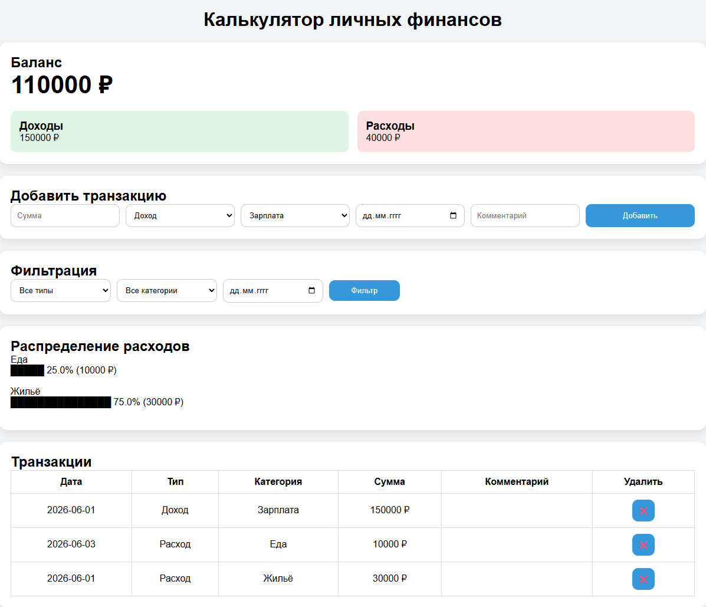

# Калькулятор личных финансов
## Деплой: https://laffite206.github.io/finance-calculator/


## Возможности:
- Добавление доходов и расходов
- Автоматический расчёт баланса
- Подсчёт общей суммы доходов
- Подсчёт общей суммы расходов
- Фильтрация операций по типу
- Фильтрация операций по категории
- Фильтрация операций по дате
- Удаление транзакций
- Сохранение данных в LocalStorage
- Текстовая диаграмма распределения расходов
- Адаптивный интерфейс для ПК и мобильных устройств

## Технология:

| Технология | Назначение |
|------------|------------|
| HTML5 | Структура страницы |
| CSS3 | Стилизация и адаптив |
| JavaScript (ES6+) | Логика приложения |
| localStorage | Сохранение истории |
| Git | Контроль версий |
| GitHub Pages | Деплой |

## Установка и запуск

```bash
# Клонировать репозиторий:
git clone https://github.com/Laffite206/finance-calculator.git

# Перейти в папку проекта:
cd finance-calculator

# Открыть файл:
index.html

# или запустить через Live Server в Visual Studio Code.